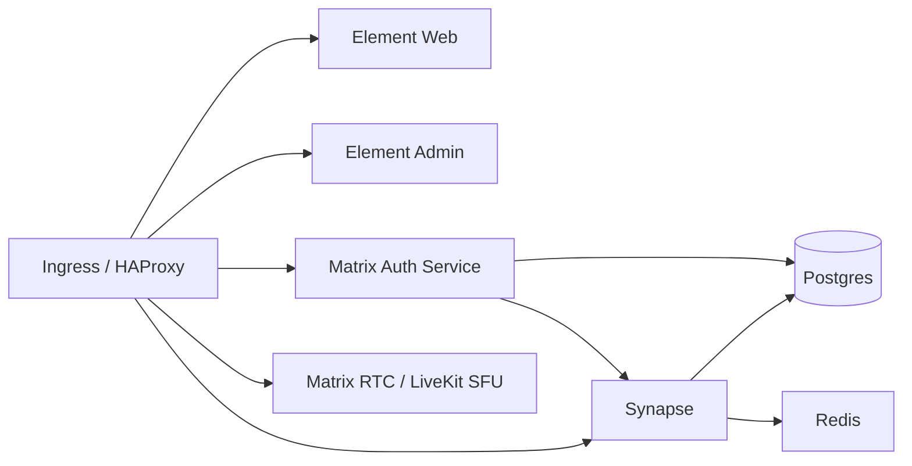

# ESS Deployment Guide

Deploy Element Server Suite (ESS) Community on your own server: local Mac dev cluster, production Ubuntu/EC2 box, moving servers, gotchas, cost, scaling.

For the official upstream quick-setup guide, see `README.md`.

---

## Contents

- [Architecture](#architecture)
- [Local Mac dev deploy (k3d)](#local-mac-dev-deploy-k3d)
- [Production on-prem / EC2 deploy (K3s)](#production-on-prem--ec2-deploy-k3s)
- [Changing the public IP / moving servers](#changing-the-public-ip--moving-servers)
- [Custom config overrides](#custom-config-overrides)
- [Known gotchas](#known-gotchas)
- [Services, licensing & cost](#services-licensing--cost)
- [Scaling under load](#scaling-under-load)
  - [Scaling Matrix RTC (calls)](#scaling-matrix-rtc-calls)

---

## Architecture

Helm chart `charts/matrix-stack` deploys these into one k8s namespace:



| Component | Role |
|---|---|
| Synapse | Matrix homeserver |
| Matrix Authentication Service (MAS) | OIDC-based auth |
| HAProxy | Routing + `.well-known` delegation |
| PostgreSQL | Database (bundled by default, or point at your own) |
| Element Web | Web chat client |
| Element Admin | Admin console |
| Matrix RTC (LiveKit SFU + auth service) | Voice/video calls |
| Matrix Hookshot | Bridges rooms to GitHub/GitLab/Jira/webhooks |
| Redis | Synapse worker pub/sub |

Each component can be enabled/disabled and customized independently via values.

---

## Local Mac dev deploy (k3d)

Uses the repo's own dev tooling (`DEVELOPERS.md` → "Running a test cluster").

### Prereqs

Docker Desktop running, plus `uv`, Helm v3, `yq`, `k3d`:

```bash
docker info
uv --version
helm version
yq --version
k3d version
```

### Python env

```bash
uv sync
source .venv/bin/activate
which pytest   # confirms the venv actually activated
```

### Cluster

```bash
./scripts/setup_test_cluster.sh
```

Installs ingress controller (host 80/443), `metrics-server`, `cert-manager`, and a self-signed CA at `~/.config/ess-helm-ca` (persists across cluster recreation). Namespace defaults to `ess`; override with `ESS_NAMESPACES`.

Stale cluster from a previous attempt:

```bash
./scripts/destroy_test_cluster.sh
./scripts/setup_test_cluster.sh
```

Check:

```bash
docker ps -a
kubectl get nodes
```

### Trust the cert

```bash
sudo security add-trusted-cert -d -r trustRoot -k /Library/Keychains/System.keychain ~/.config/ess-helm-ca/ca.crt
security find-certificate -c "ess-ca"   # confirm it landed
```

### Deploy

```bash
helm -n ess upgrade -i ess charts/matrix-stack \
  -f charts/matrix-stack/ci/test-cluster-mixin.yaml \
  -f charts/matrix-stack/ci/example-default-enabled-components-values.yaml \
  -f charts/matrix-stack/user_values/local.yaml
```

The `user_values/local.yaml` `-f` is only needed if you've created that file for your own overrides (gitignored by default) — see [Custom config overrides](#custom-config-overrides).

```bash
kubectl get pods -n ess
```

Postgres and Synapse can sit `Pending` for a minute on first boot — normal.

### Create a user

```bash
kubectl exec -n ess -it deploy/ess-matrix-authentication-service -- mas-cli manage register-user
```

### Verify

- `https://element.ess.localhost` loads clean, no cert warning
- Log into Element Web with the user just created

### Teardown

```bash
./scripts/destroy_test_cluster.sh
```

---

## Production on-prem / EC2 deploy (K3s)

Single Ubuntu box, bare metal / home server / plain VPS/EC2, no managed Kubernetes needed. K3s + bundled Traefik on 80/443, routes by hostname to HAProxy → Synapse/MAS. cert-manager handles Let's Encrypt renewal.

### Before you start

**Hardware.** 2 cores/2GB RAM is the floor. 4 cores/8GB minimum with Synapse + Postgres + RTC together. Disk 40-50GB+. Check `df -h /` first (some AWS AMIs default to an 8GB root volume).

Growing an EBS-backed root volume live, no reboot:

```bash
lsblk                              # confirm the disk shows the new size
sudo growpart /dev/nvme0n1 1       # or /dev/xvda 1 on older instance types — check lsblk
sudo resize2fs /dev/nvme0n1p1      # match the partition name from growpart's output
df -h /                            # should show the new size
```

**Domain.** The "server name" (`@alice:example.com` part after `:`) **cannot change later without wiping the database**. Point DNS at the public IP:

```
example.com          A  <public IP>
synapse.example.com  A  <public IP>
account.example.com  A  <public IP>
mrtc.example.com     A  <public IP>
element.example.com  A  <public IP>
admin.example.com    A  <public IP>
```

No domain / throwaway test box: `nip.io` resolves `<anything>.<ip-with-dashes>.nip.io` to that IP with zero DNS setup. Not for anything long-term — server name can't move later.

**Ports** — open on host and anything in front of it (router / cloud security group):

| Port | Proto | For |
|---|---|---|
| 22 | tcp | SSH |
| 80 | tcp | HTTP→HTTPS redirect, Let's Encrypt HTTP-01 |
| 443 | tcp | everything else |
| 30001 | tcp | RTC/SFU, WebRTC TCP fallback |
| 30002 | udp | RTC/SFU, WebRTC media |

Cloud provider: security-group setting, not `ufw`.

### 1. Base OS

```bash
sudo apt-get update && sudo apt-get upgrade -y
sudo apt-get install -y curl git jq ufw

sudo ufw allow 22/tcp
sudo ufw allow 80/tcp
sudo ufw allow 443/tcp
sudo ufw allow 30001/tcp
sudo ufw allow 30002/udp
sudo ufw enable
```

### 2. K3s

```bash
curl -sfL https://get.k3s.io | sh -

mkdir -p ~/.kube
sudo cp /etc/rancher/k3s/k3s.yaml ~/.kube/config
sudo chown "$USER:$USER" ~/.kube/config
chmod 600 ~/.kube/config
echo 'export KUBECONFIG=~/.kube/config' >> ~/.bashrc
export KUBECONFIG=~/.kube/config

kubectl get nodes   # one node, Ready
```

### 3. Helm

```bash
curl -fsSL https://raw.githubusercontent.com/helm/helm/main/scripts/get-helm-3 | bash
helm version --short
```

### 4. cert-manager + Let's Encrypt

```bash
helm upgrade --install cert-manager \
  oci://quay.io/jetstack/charts/cert-manager \
  --namespace cert-manager --create-namespace \
  --version v1.17.0 \
  --set crds.enabled=true \
  --timeout 10m --wait

kubectl get pods -n cert-manager   # 3 pods, all 1/1 Running
```

Staging issuer first — proves the HTTP-01 path works without burning a real Let's Encrypt request/rate-limit:

```bash
kubectl apply -f - <<EOF
apiVersion: cert-manager.io/v1
kind: ClusterIssuer
metadata:
  name: letsencrypt-staging
spec:
  acme:
    server: https://acme-staging-v02.api.letsencrypt.org/directory
    email: you@example.com
    privateKeySecretRef:
      name: letsencrypt-staging
    solvers:
    - http01:
        ingress:
          class: traefik
EOF

kubectl apply -f - <<EOF
apiVersion: cert-manager.io/v1
kind: ClusterIssuer
metadata:
  name: letsencrypt-prod
spec:
  acme:
    server: https://acme-v02.api.letsencrypt.org/directory
    email: you@example.com
    privateKeySecretRef:
      name: letsencrypt-prod
    solvers:
    - http01:
        ingress:
          class: traefik
EOF
```

### 5. Values files

```bash
mkdir -p ~/ess-values
kubectl create namespace ess
```

`~/ess-values/hostnames.yaml` — nested under `ingress:`, not a flat `hostname:` key (flat form fails schema validation). Source of truth: `charts/matrix-stack/ci/fragments/quick-setup-hostnames.yaml`.

```yaml
serverName: example.com

synapse:
  ingress:
    host: synapse.example.com

matrixAuthenticationService:
  ingress:
    host: account.example.com

matrixRTC:
  ingress:
    host: mrtc.example.com

elementWeb:
  ingress:
    host: element.example.com

elementAdmin:
  ingress:
    host: admin.example.com
```

`~/ess-values/tls.yaml` — start on staging:

```yaml
certManager:
  clusterIssuer: letsencrypt-staging
```

Chart deploys its own Postgres by default — fine to start. For anything you care about, point at a Postgres instance you manage and back up yourself (see `docs/advanced.md`).

### 6. Deploy

```bash
helm upgrade --install ess oci://ghcr.io/element-hq/ess-helm/matrix-stack \
  --namespace ess \
  -f ~/ess-values/hostnames.yaml \
  -f ~/ess-values/tls.yaml \
  --wait --timeout 20m

kubectl get pods -n ess
```

Once staging certs issue fine (`kubectl get certificate -n ess` → all `READY True`), switch `tls.yaml` to `clusterIssuer: letsencrypt-prod` and re-run the same command.

### 7. First users

Registration closed by default (open registration on an internet-facing server gets farmed for spam within hours):

```bash
kubectl exec -n ess -it deploy/ess-matrix-authentication-service -- mas-cli manage register-user
```

Non-interactively:

```bash
kubectl exec -n ess deploy/ess-matrix-authentication-service -- \
  mas-cli manage register-user --yes --password 'something-strong' alice
```

Self-registration later needs SMTP on MAS (see `docs/advanced.md`) — don't disable email verification without enabling registration tokens too.

### 8. Actually check it works

```bash
curl https://example.com/.well-known/matrix/client
curl https://example.com/.well-known/matrix/server
```

Both return JSON pointing at the `synapse.` and `mrtc.` hosts.

Federation: `https://federationtester.matrix.org/#example.com`, or `https://federationtester.matrix.org/api/report?server_name=example.com` → check `FederationOK: true`.

MAS reachable/speaking OIDC: `https://account.example.com/.well-known/openid-configuration` returns something.

Login has to happen in a browser (MAS is authorization_code-flow-only). Open `https://element.example.com`.

### Upgrading later

Same command as [step 6](#6-deploy), run again. Check `CHANGELOG.md` before jumping major versions.

### Backups

Manual, no cloud snapshot layer does this for you:

- Postgres: `kubectl exec -n ess deploy/ess-postgresql -- pg_dumpall -U postgres > backup.sql`, cron it, copy off-box.
- Generated secrets: `kubectl get secret ess-generated -n ess -o yaml > ess-generated-secret.yaml` — needed to recover without regenerating every credential.
- Media: `ess-synapse-media` PVC, local disk. Snapshot at filesystem level or rsync elsewhere.

### Production checklist (once this stops being a test box)

- [ ] External Postgres, not the bundled one, with its own backup schedule
- [ ] Media storage off local disk (S3-compatible or NFS)
- [ ] SMTP on MAS so registration/password-reset works
- [ ] Firewall/security-group rules trimmed to just what's needed
- [ ] Prometheus Operator installed, if the chart's `ServiceMonitor`s should do anything
- [ ] Automated, off-host backups actually running
- [ ] Some thought given to what happens if the box loses power mid-write — single node, no failover

### Troubleshooting

```bash
kubectl get pods -n ess
kubectl logs -n ess deploy/ess-synapse
kubectl logs -n ess deploy/ess-matrix-authentication-service
kubectl logs -n ess deploy/ess-matrix-rtc-sfu
kubectl describe certificate -n ess     # cert-manager / Let's Encrypt stuck? start here
```

More scenarios in `docs/troubleshooting.md`.

### Tearing it down

```bash
helm uninstall ess -n ess
kubectl delete secrets/ess-generated -n ess
kubectl delete configmap/ess-deployment-markers -n ess
kubectl delete pvc/ess-synapse-media -n ess
kubectl delete pvc/ess-postgres-data -n ess
# or just wipe the whole namespace:
kubectl delete namespace ess

helm uninstall cert-manager -n cert-manager
rm -rf /usr/local/bin/helm $HOME/.cache/helm $HOME/.config/helm $HOME/.local/share/helm
/usr/local/bin/k3s-uninstall.sh
rm -rf ~/ess-values ~/.kube
```

---

## Changing the public IP / moving servers

Covers moving to a brand-new box, or same box getting a new public IP. Fix is the same either way: DNS catches up, TLS re-validates.

Assumes a working deploy per the [production section](#production-on-prem--ec2-deploy-k3s). `serverName` is **not** changing — only its IP. Changing `serverName` itself is out of scope (no clean migration path, effectively a fresh server for federation).

### 1. Update DNS first

```bash
dig +short example.com
dig +short synapse.example.com
```

Both should return the new IP. Wait out propagation before continuing.

### 2. Open ports on the new box / security group

Same set as original deploy (22, 80, 443, 30001/tcp, 30002/udp).

### 3. If this is a new box: redeploy

Follow [production deploy](#production-on-prem--ec2-deploy-k3s) steps 1-6 fresh, reusing the same `hostnames.yaml`, and **restoring data before deploying, not after**:

- Restore the Postgres dump into the new Postgres pod (or point `postgresql.yaml` at your externally-managed instance).
- Restore the `ess-generated` secret (`kubectl apply -f ess-generated-secret.yaml -n ess`) **before** the first `helm install` — keeps existing accounts/device sessions valid.
- Restore the `ess-synapse-media` PVC contents.

Start TLS on `letsencrypt-staging` again first. Switch to `letsencrypt-prod` once staging certs come back `READY True`.

### 4. If it's the same box, just a new IP: nothing to redeploy

K3s/Traefik/cert-manager don't care about the public IP. Once DNS resolves and ports are open, existing certs keep working; cert-manager renews normally.

Force-check rather than wait:

```bash
kubectl get certificate -n ess
kubectl describe certificate -n ess     # confirm not stuck mid-challenge
```

### 5. Verify

```bash
curl https://example.com/.well-known/matrix/client
curl https://example.com/.well-known/matrix/server
```

Federation: `https://federationtester.matrix.org/api/report?server_name=example.com` → `FederationOK: true`.

Login: open `https://element.example.com` with an existing account — should just work if `ess-generated` secret and media PVC were restored correctly.

### Gotchas

- **Elastic/static IP**, if available, avoids this whole doc going forward.
- **DNS TTL**: set low (300s or less) on records likely to move again.
- **Old IP cached elsewhere**: federation from servers with a cached old IP fails until their cache expires — not controllable.
- **Don't skip the staging cert step on a new box** — it's hitting Let's Encrypt for the first time regardless of prior success elsewhere.

---

## Custom config overrides

`charts/matrix-stack/user_values/` is where your own per-environment tweaks go, as extra `-f` values files (last `-f` wins on conflicts). Gitignored by default.

Common overrides:

- **User directory search across the whole server**, not just shared rooms:

  ```yaml
  synapse:
    additional:
      user-directory:
        config: |
          user_directory:
            enabled: true
            search_all_users: true
  ```

- **Disabling STUN-based public IP discovery for the RTC SFU** — needed on local/NAT'd clusters (k3d, home lab), otherwise the SFU advertises an address clients can't reach and calls drop mid-call. Not needed on a real public server:

  ```yaml
  matrixRTC:
    sfu:
      useStunToDiscoverPublicIP: false
  ```

- **Toggling E2EE defaults for clients**, via `wellKnownDelegation.additional.client`, e.g. `'{"io.element.e2ee": {"force_disable": true}}'` (leave out entirely to keep encryption enabled with per-room toggle).

Any Synapse setting can be injected under `synapse.additional.<name>.config` — see `docs/advanced.md` for the full mechanism and other components' equivalents.

---

## Known gotchas

| Issue | Cause | Fix |
|---|---|---|
| Helm `json.decoder.JSONDecodeError` | Helm 4.x changed OCI pull output format; `pyhelm3` (used by setup scripts) incompatible | `brew install helm@3 && brew link --force helm@3` — must be 3.x, not 4 |
| `sudo security add-trusted-cert` fails: `/var/root/...` | `~` expands to `/var/root` under `sudo` | Use full path, e.g. `/Users/$USER/.config/ess-helm-ca/ca.crt` |
| Element Web "misconfigured" | Browser rejects self-signed cert → AJAX to Synapse blocked | Trust the CA cert before opening Element Web, fully quit (Cmd+Q) and reopen |
| Calls connect then drop mid-call (`UNKNOWN_ERROR`) on local k3d | `matrixRTC.sfu.useStunToDiscoverPublicIP` defaults `true` — wrong on local/NAT'd clusters. STUN finds an unreachable external IP, uses it anyway for `NAT1To1Ips` | Set `useStunToDiscoverPublicIP: false` in `user_values/local.yaml`, `helm upgrade`, `kubectl rollout restart deploy/ess-matrix-rtc-sfu -n ess` |
| "Confirm digital identity" on first login | Normal MAS / E2E device-verification flow | Generate a security key, or skip for dev |
| `hostnames.yaml` rejected: "additional properties not allowed" | Flat `hostname:` key instead of nested `ingress:` | Use nested form (see [step 5](#5-values-files)), or copy `charts/matrix-stack/ci/fragments/quick-setup-hostnames.yaml` |
| `values.yaml` edits don't take effect | It's a generated file | Edit `source/values.yaml.j2` instead, or use `user_values/local.yaml` for local-only changes |
| A values override silently stops applying / component crashes parsing config | Two top-level keys with the same name in one values file — YAML lets the later one clobber the earlier | One top-level key per component per file; merge new fields into the existing block instead of adding a second header |

---

## Services, licensing & cost

### Deployed by the chart

All free/open source; nothing here carries a license fee.

| Component | Role | License |
|---|---|---|
| Synapse | Matrix homeserver | AGPL-3.0 |
| MAS | OIDC auth | OSS |
| Element Web / Admin | Web client / admin console | OSS |
| Matrix RTC (`livekit-server` + `lk-jwt-service`) | Calls (SFU + join tokens), self-hosted | OSS |
| HAProxy | Ingress routing | OSS |
| Matrix Hookshot | GitHub/GitLab/Jira/webhook bridges | OSS |
| PostgreSQL | DB for Synapse + MAS | OSS |
| Redis | Synapse pub/sub cache | BSD-3 |
| matrix-tools | Secret-gen init container, built by this project | OSS |
| postgres-exporter / redis-exporter | Optional Prometheus sidecars | OSS |
| cert-manager | Optional, automates TLS via Let's Encrypt (also free) | OSS |

### Needed around the chart, not deployed by it

| Dependency | Free tier | Costs money when |
|---|---|---|
| Docker Desktop | Personal / small biz | Past 250 employees or $10M revenue |
| k3d, Helm, uv, yq | Always free | — local/CI tooling only |
| Kubernetes (managed: EKS/GKE/AKS) | N/A | Always billed per node/cluster |
| ghcr.io, oci.element.io | Free for public images | — |
| Docker Hub | Free public pulls | Rate-limited; private repos paid |
| GitHub Actions | Free on public repos | Private repos past included minutes |
| Cloud compute (EC2 etc) | Never free | Always, billed hourly |

### Running this for a company

This chart is **ESS Community** — capped by Element at small/mid-scale, non-commercial, up to 100 users:

- Under ~100 people, non-commercial-ish — Community as-is, free.
- Past 100, or enterprise features/support needed — **ESS Pro** (IAM, HA, multi-tenancy, compliance, support contracts).
- Regulated healthcare in Germany — **ESS TI-M** (Pro variant, Gematik TI-Messenger/ePA compliance).

At real company scale, the free tiers above stop covering it regardless of edition: Docker Desktop past its threshold, private-repo Actions minutes, Docker Hub pull limits under heavy CI, cloud compute (scales with headcount either way).

---

## Scaling under load

No autoscaling anywhere in the chart's templates — every scale-up is a manual `replicas:`/resource bump + `helm upgrade`.

| Component | Backing resource | Horizontal (replicas) | Vertical (resources) | Notes |
|---|---|---|---|---|
| Element Web | Deployment | Yes, freely | Yes | Stateless, `elementWeb.replicas` |
| Element Admin | Deployment | Yes, freely | Yes | Stateless, `elementAdmin.replicas` |
| HAProxy | Deployment | Yes, freely | Yes | Stateless router, `haproxy.replicas` |
| Matrix Authentication Service | Deployment | Yes | Yes | Stateless, session state in Postgres; `matrixAuthenticationService.replicas` |
| Synapse (main process) | StatefulSet | **No** — see workers below | Yes | `synapse.replicas`; without worker mode this just runs redundant copies, not real scale-out |
| Synapse workers | Deployments (one per type) | **Yes, if worker mode on** | Yes | See below |
| Postgres (bundled) | StatefulSet | No | Yes | Single instance; for real scale-out, use external/managed Postgres |
| Redis | StatefulSet | No, not meaningfully | Yes | Single instance, pubsub/cache for Synapse |
| Matrix Hookshot | StatefulSet | Not normally | Yes | Bridges/webhooks, not a hot path |
| Matrix RTC SFU / auth service | Deployments | **No**, not out of the box | Yes | See [Scaling Matrix RTC](#scaling-matrix-rtc-calls) |

### Synapse: turn on worker mode before scaling out

By default `synapse.workers` are all `enabled: false` — everything runs in the single main process, so bumping `synapse.replicas` alone just runs redundant copies against the same DB.

To scale horizontally, enable the specific worker types that match the bottleneck and give each its own `replicas`. Available types in `values.yaml` (`synapse.workers.<name>`):

`account-data`, `appservice`, `background`, `client-reader`, `device-lists`, `encryption`, `event-creator`, `event-persister`, `federation-inbound`, `federation-reader`, `federation-sender`, `initial-synchrotron`, `mas-helper`, `media-repository`, `presence-writer`, `push-rules`, `pusher`, `receipts`, `sliding-sync`, `sso-login`, `synchrotron`, `typing-persister`, `user-dir`.

Example — offload sync traffic, 2 replicas:

```yaml
synapse:
  workers:
    synchrotron:
      enabled: true
      replicas: 2
```

`helm upgrade` as usual — HAProxy routing to enabled workers is automatic. Postgres remains the shared bottleneck underneath: worker mode spreads CPU/request load, not DB load, so a heavily-loaded worker deployment usually means Postgres needs to scale too.

### Scaling Matrix RTC (calls)

Two replica counts, both default 1: `matrixRTC.sfu.replicas`, `matrixRTC.authorisationService.replicas`. No autoscaler — manual, but vertical scaling works fine out of the box.

Horizontal doesn't work as shipped: bumping `sfu.replicas` past 1 gives independent SFU pods with no coordination. LiveKit's real multi-node mode needs a shared Redis backend for room/node discovery, which this chart's SFU config doesn't set up.

Real horizontal scale-out means wiring up LiveKit's Redis-backed clustering yourself, or moving to ESS Pro / LiveKit Cloud.

### When Community's ceiling is the real limit

Past ~100 users, or once true HA/multi-tenancy/dynamic autoscaling is needed — that's **ESS Pro** (see [Services, licensing & cost](#services-licensing--cost)).
