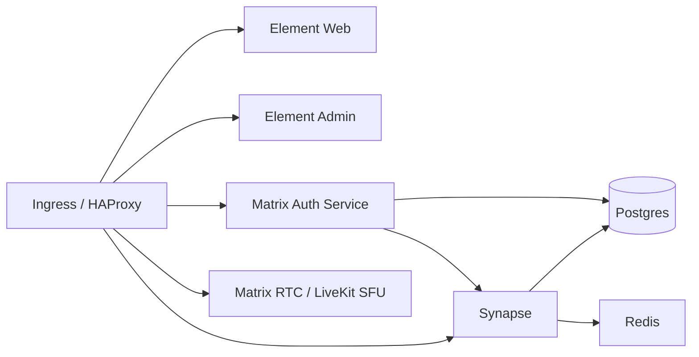

# ESS Deployment Guide

Everything needed to take this repo and deploy Element Server Suite (ESS) Community on **your own server** — a local Mac dev cluster to try it out, a production Ubuntu/EC2 box for real use, moving that server to a new IP later, common gotchas, what it costs to run, and how to scale it as load grows. Anyone cloning this repo can follow this doc end-to-end without prior context.

For the official upstream quick-setup guide (Let's Encrypt / reverse-proxy options in more depth), see `README.md`. This doc is a more opinionated, step-by-step path through the same territory.

---

## Contents

- [Architecture](#architecture)
- [Local Mac dev deploy (k3d)](#local-mac-dev-deploy-k3d)
- [Production on-prem / EC2 deploy (K3s)](#production-on-prem--ec2-deploy-k3s)
- [Changing the public IP / moving servers](#changing-the-public-ip--moving-servers)
- [Custom config overrides](#custom-config-overrides)
- [SSO / upstream OIDC (e.g. Keycloak)](#sso--upstream-oidc-eg-keycloak)
- [Known gotchas](#known-gotchas)
- [Services, licensing & cost](#services-licensing--cost)
- [Scaling under load](#scaling-under-load)
  - [Scaling Matrix RTC (calls)](#scaling-matrix-rtc-calls)

---

## Architecture

Helm chart `charts/matrix-stack` deploys these into one k8s namespace:



| Component | Role |
|---|---|
| Synapse | Matrix homeserver |
| Matrix Authentication Service (MAS) | OIDC-based auth |
| HAProxy | Routing + `.well-known` delegation |
| PostgreSQL | Database (bundled by default, or point at your own) |
| Element Web | Web chat client |
| Element Admin | Admin console |
| Matrix RTC (LiveKit SFU + auth service) | Voice/video calls |
| Matrix Hookshot | Bridges rooms to GitHub/GitLab/Jira/webhooks |
| Redis | Synapse worker pub/sub |

Each component can be enabled/disabled and customized independently via values.

---

## Local Mac dev deploy (k3d)

Follows the `DEVELOPERS.md` → "Running a test cluster" path — i.e. the repo's own dev tooling, not a hand-rolled k3d cluster.

### Prereqs

Docker Desktop running, plus `uv`, Helm v3, `yq`, `k3d`:

```bash
docker info
uv --version
helm version
yq --version
k3d version
```

### Python env

```bash
uv sync
source .venv/bin/activate
which pytest   # confirms the venv actually activated
```

### Cluster

```bash
./scripts/setup_test_cluster.sh
```

Installs an ingress controller (bound to host 80/443 so `https://anything.<namespace>.localhost` works), `metrics-server`, `cert-manager`, and a self-signed CA persisted at `~/.config/ess-helm-ca` (survives cluster recreation — trust it once, reuse it). Defaults to namespace `ess`; override with `ESS_NAMESPACES` (space-separated list) for more.

If a stale cluster is lying around from a previous attempt (containers showing `Exited`):

```bash
./scripts/destroy_test_cluster.sh
./scripts/setup_test_cluster.sh
```

Check:

```bash
docker ps -a
kubectl get nodes
```

### Trust the cert

```bash
sudo security add-trusted-cert -d -r trustRoot -k /Library/Keychains/System.keychain ~/.config/ess-helm-ca/ca.crt
security find-certificate -c "ess-ca"   # confirm it landed
```

### Deploy

```bash
helm -n ess upgrade -i ess charts/matrix-stack \
  -f charts/matrix-stack/ci/test-cluster-mixin.yaml \
  -f charts/matrix-stack/ci/example-default-enabled-components-values.yaml \
  -f charts/matrix-stack/user_values/local.yaml
```

The `user_values/local.yaml` `-f` is only needed if you've created that file for your own overrides (it's gitignored by default) — see [Custom config overrides](#custom-config-overrides).

```bash
kubectl get pods -n ess
```

Postgres and Synapse can sit `Pending` for a minute on first boot — normal, let it settle.

### Create a user

```bash
kubectl exec -n ess -it deploy/ess-matrix-authentication-service -- mas-cli manage register-user
```

### Verify

- `https://element.ess.localhost` loads clean, no cert warning
- Log into Element Web with the user just created
- If that works, done.

### Teardown

```bash
./scripts/destroy_test_cluster.sh
```

---

## Production on-prem / EC2 deploy (K3s)

Full walkthrough for a single Ubuntu box you control — bare metal, home server, or a plain VPS/EC2 instance without a managed Kubernetes service. Everything runs through K3s on the one machine; no cloud APIs required. Traefik (bundled with K3s) sits on 80/443 and routes by hostname to HAProxy, which routes Matrix API traffic to Synapse or MAS. cert-manager talks to Let's Encrypt and renews TLS automatically.

### Before you start

**Hardware.** 2 cores/2GB RAM is the floor (will swap constantly). 4 cores/8GB is a saner minimum with Synapse + Postgres + RTC all running together. Disk: 40-50GB+ — 20GB is not enough once container images plus a growing Postgres + media volume are accounted for. Check `df -h /` before installing anything (some AWS AMIs default to an 8GB root volume).

Growing an EBS-backed root volume after the fact (live, no reboot):

```bash
lsblk                              # confirm the disk shows the new size
sudo growpart /dev/nvme0n1 1       # or /dev/xvda 1 on older instance types — check lsblk
sudo resize2fs /dev/nvme0n1p1      # match the partition name from growpart's output
df -h /                            # should show the new size
```

**Domain.** The "server name" is the part after `:` in a Matrix ID (`@alice:example.com`) — **cannot be changed later without wiping the database**. With a real domain, point DNS at the public IP:

```
example.com          A  <public IP>
synapse.example.com  A  <public IP>
account.example.com  A  <public IP>
mrtc.example.com     A  <public IP>
element.example.com  A  <public IP>
admin.example.com    A  <public IP>
```

For a throwaway test box without a domain, `nip.io` resolves `<anything>.<ip-with-dashes>.nip.io` straight to that IP with zero DNS setup (e.g. `element.98-80-225-142.nip.io` for IP `98.80.225.142`). Not for anything long-term, since the server name can't move later.

**Ports** — open on the host and whatever's in front of it (router / cloud security group):

| Port | Proto | For |
|---|---|---|
| 22 | tcp | SSH |
| 80 | tcp | HTTP→HTTPS redirect, Let's Encrypt HTTP-01 challenge |
| 443 | tcp | everything else |
| 30001 | tcp | RTC/SFU, WebRTC TCP fallback |
| 30002 | udp | RTC/SFU, WebRTC media |

On a cloud provider this is a security-group setting, not `ufw` — `ufw` only matters for traffic that already reached the box.

### 1. Base OS

```bash
sudo apt-get update && sudo apt-get upgrade -y
sudo apt-get install -y curl git jq ufw

sudo ufw allow 22/tcp
sudo ufw allow 80/tcp
sudo ufw allow 443/tcp
sudo ufw allow 30001/tcp
sudo ufw allow 30002/udp
sudo ufw enable
```

### 2. K3s

```bash
curl -sfL https://get.k3s.io | sh -

mkdir -p ~/.kube
sudo cp /etc/rancher/k3s/k3s.yaml ~/.kube/config
sudo chown "$USER:$USER" ~/.kube/config
chmod 600 ~/.kube/config
echo 'export KUBECONFIG=~/.kube/config' >> ~/.bashrc
export KUBECONFIG=~/.kube/config

kubectl get nodes   # one node, Ready
```

### 3. Helm

```bash
curl -fsSL https://raw.githubusercontent.com/helm/helm/main/scripts/get-helm-3 | bash
helm version --short
```

### 4. cert-manager + Let's Encrypt

```bash
helm upgrade --install cert-manager \
  oci://quay.io/jetstack/charts/cert-manager \
  --namespace cert-manager --create-namespace \
  --version v1.17.0 \
  --set crds.enabled=true \
  --timeout 10m --wait

kubectl get pods -n cert-manager   # 3 pods, all 1/1 Running
```

Create both a staging and a production issuer — deploy against staging first to prove the HTTP-01 challenge path reaches the box (DNS/ports/security-group correct) without burning a real Let's Encrypt request or its rate limit while still debugging:

```bash
kubectl apply -f - <<EOF
apiVersion: cert-manager.io/v1
kind: ClusterIssuer
metadata:
  name: letsencrypt-staging
spec:
  acme:
    server: https://acme-staging-v02.api.letsencrypt.org/directory
    email: you@example.com
    privateKeySecretRef:
      name: letsencrypt-staging
    solvers:
    - http01:
        ingress:
          class: traefik
EOF

kubectl apply -f - <<EOF
apiVersion: cert-manager.io/v1
kind: ClusterIssuer
metadata:
  name: letsencrypt-prod
spec:
  acme:
    server: https://acme-v02.api.letsencrypt.org/directory
    email: you@example.com
    privateKeySecretRef:
      name: letsencrypt-prod
    solvers:
    - http01:
        ingress:
          class: traefik
EOF
```

### 5. Values files

```bash
mkdir -p ~/ess-values
kubectl create namespace ess
```

`~/ess-values/hostnames.yaml` — mind the schema: nested under `ingress:`, not a flat `hostname:` key (a flat form gets rejected by the chart's schema validation with an "additional properties not allowed" error). If the shape ever drifts, the source of truth is `charts/matrix-stack/ci/fragments/quick-setup-hostnames.yaml` in this repo — copy from there directly if in doubt:

```yaml
serverName: example.com

synapse:
  ingress:
    host: synapse.example.com

matrixAuthenticationService:
  ingress:
    host: account.example.com

matrixRTC:
  ingress:
    host: mrtc.example.com

elementWeb:
  ingress:
    host: element.example.com

elementAdmin:
  ingress:
    host: admin.example.com
```

`~/ess-values/tls.yaml` — start on staging:

```yaml
certManager:
  clusterIssuer: letsencrypt-staging
```

By default the chart deploys its own Postgres — fine to get running and to test with. For anything you actually care about, point it at a Postgres instance you manage and back up yourself (see `docs/advanced.md`).

### 6. Deploy

```bash
helm upgrade --install ess oci://ghcr.io/element-hq/ess-helm/matrix-stack \
  --namespace ess \
  -f ~/ess-values/hostnames.yaml \
  -f ~/ess-values/tls.yaml \
  --wait --timeout 20m

kubectl get pods -n ess
```

Once everything's up and staging certs issue fine (`kubectl get certificate -n ess` → all `READY True`), switch `tls.yaml` to `clusterIssuer: letsencrypt-prod` and re-run the same command — Helm re-issues real certs over the staging ones.

### 7. First users

Registration is closed by default on purpose — an internet-facing Matrix server with open registration gets found and farmed for spam accounts within hours.

```bash
kubectl exec -n ess -it deploy/ess-matrix-authentication-service -- mas-cli manage register-user
```

Non-interactively:

```bash
kubectl exec -n ess deploy/ess-matrix-authentication-service -- \
  mas-cli manage register-user --yes --password 'something-strong' alice
```

To let people register themselves later, MAS needs SMTP configured (see `docs/advanced.md`) — don't turn off email verification without also turning on registration tokens, or it's the spam problem again.

### 8. Actually check it works

```bash
curl https://example.com/.well-known/matrix/client
curl https://example.com/.well-known/matrix/server
```

Both should return JSON pointing at the `synapse.` and `mrtc.` hosts.

Federation check: `https://federationtester.matrix.org/#example.com`, or the API directly — `https://federationtester.matrix.org/api/report?server_name=example.com`, check `FederationOK` is `true`.

MAS is reachable and speaking OIDC if `https://account.example.com/.well-known/openid-configuration` returns something.

Actual login has to happen in a browser — MAS is authorization_code-flow-only, no password endpoint to curl. Open `https://element.example.com` and log in.

### Upgrading later

Same command as install, run again:

```bash
helm upgrade ess oci://ghcr.io/element-hq/ess-helm/matrix-stack \
  --namespace ess \
  -f ~/ess-values/hostnames.yaml \
  -f ~/ess-values/tls.yaml \
  --wait --timeout 20m
```

Check `CHANGELOG.md` before jumping major versions.

### Backups

No cloud snapshot layer does this for you here — it's manual:

- Postgres: `kubectl exec -n ess deploy/ess-postgresql -- pg_dumpall -U postgres > backup.sql`, cron it, copy off-box.
- Generated secrets: `kubectl get secret ess-generated -n ess -o yaml > ess-generated-secret.yaml`. Needed to recover without regenerating every credential from scratch.
- Media uploads live on the `ess-synapse-media` PVC, backed by local disk. Snapshot at the filesystem level or rsync elsewhere. If a single disk failure would also wipe the only backup, that's not a backup.

### Production checklist (once this stops being a test box)

- [ ] External Postgres, not the bundled one, with its own backup schedule
- [ ] Media storage off local disk (S3-compatible or NFS) if it needs to survive a disk failure
- [ ] SMTP on MAS so real registration/password-reset works
- [ ] Firewall/security-group rules trimmed to just what's needed
- [ ] Prometheus Operator installed, if the chart's `ServiceMonitor`s should do anything
- [ ] Automated, off-host backups actually running, not just documented
- [ ] Some thought given to what happens if the box loses power mid-write — single node, no failover

### Troubleshooting

```bash
kubectl get pods -n ess
kubectl logs -n ess deploy/ess-synapse
kubectl logs -n ess deploy/ess-matrix-authentication-service
kubectl logs -n ess deploy/ess-matrix-rtc-sfu
kubectl describe certificate -n ess     # cert-manager / Let's Encrypt stuck? start here
```

More scenarios in `docs/troubleshooting.md`.

### Tearing it down

```bash
helm uninstall ess -n ess
kubectl delete secrets/ess-generated -n ess
kubectl delete configmap/ess-deployment-markers -n ess
kubectl delete pvc/ess-synapse-media -n ess
kubectl delete pvc/ess-postgres-data -n ess
# or just wipe the whole namespace:
kubectl delete namespace ess

helm uninstall cert-manager -n cert-manager
rm -rf /usr/local/bin/helm $HOME/.cache/helm $HOME/.config/helm $HOME/.local/share/helm
/usr/local/bin/k3s-uninstall.sh
rm -rf ~/ess-values ~/.kube
```

---

## Changing the public IP / moving servers

Covers two cases: moving ESS to a brand-new box, or the same box getting a new public IP (re-provisioned VPS, EC2 stopped/started without an Elastic IP, ISP changed a home IP, etc). Either way the fix is the same — DNS catches up to the new IP, then TLS re-validates itself.

Assumes a working deploy per the [production section](#production-on-prem--ec2-deploy-k3s) above. `serverName` is **not** changing here — only the IP it resolves to. If `serverName` itself changes, that's a much bigger job (new server identity, no clean migration path — effectively a fresh server for federation purposes) and out of scope.

### 1. Update DNS first

Point every A record at the new IP, then confirm propagation before moving on:

```bash
dig +short example.com
dig +short synapse.example.com
```

Both should return the new IP. Low TTL propagates fast; a high TTL inherited from the old setup is worth waiting out rather than fighting.

### 2. Open ports on the new box / security group

Same set as the original deploy (22, 80, 443, 30001/tcp, 30002/udp) — nothing new.

### 3. If this is a new box: redeploy

Follow the [production deploy](#production-on-prem--ec2-deploy-k3s) steps 1-6 fresh on the new machine, reusing the same `hostnames.yaml` (unchanged, since `serverName` is unchanged), and **restoring data before deploying, not after**:

- Restore the Postgres dump into the new Postgres pod (or point `postgresql.yaml` at your externally-managed instance).
- Restore the `ess-generated` secret (`kubectl apply -f ess-generated-secret.yaml -n ess`) **before** the first `helm install` — keeps existing accounts/device sessions valid instead of the chart minting fresh credentials.
- Restore the `ess-synapse-media` PVC contents (rsync the backed-up media directory, or restore the NFS/S3 target if using off-box media storage).

Start TLS on `letsencrypt-staging` again for the first deploy on the new box — same reasoning as a fresh install, proving the HTTP-01 challenge reaches the new IP before burning a real request. Switch to `letsencrypt-prod` once staging certs come back `READY True`.

### 4. If it's the same box, just a new IP: nothing to redeploy

K3s/Traefik/cert-manager don't care what the public IP is. Once DNS resolves to the new IP and ports are open, existing certs keep working until normal renewal, and cert-manager renews fine since Let's Encrypt just re-runs HTTP-01 against whatever the hostname currently resolves to.

To force-check rather than wait for the automatic renewal window:

```bash
kubectl get certificate -n ess
kubectl describe certificate -n ess     # confirm not stuck mid-challenge
```

### 5. Verify

```bash
curl https://example.com/.well-known/matrix/client
curl https://example.com/.well-known/matrix/server
```

Federation: `https://federationtester.matrix.org/api/report?server_name=example.com`, check `FederationOK` is `true`.

Login: open `https://element.example.com`, log in with an existing account. With the `ess-generated` secret and media PVC restored correctly, this should just work — same accounts, same room history, no re-registration.

### Gotchas

- **Elastic IP / static IP**, if the cloud provider offers one, avoids this entire doc going forward — worth attaching one after the first time this has to be done manually.
- **DNS TTL**: set it low (300s or less) on records likely to move again.
- **Old IP cached elsewhere**: federation from servers that cached the old IP fails until their cache expires — not something you control, clears itself on the old TTL.
- **Don't skip the staging cert step on a new box** even though it feels redundant "because it worked before" — it's a new box hitting Let's Encrypt for the first time, same debugging value as a first-ever deploy.

---

## Custom config overrides

`charts/matrix-stack/user_values/` is where your own per-environment tweaks go, as extra `-f` values files layered on top of the base deploy command (last `-f` wins on conflicts). Anything placed here is gitignored by default — it won't get committed or conflict with upstream updates.

Common things people override here:

- **User directory search across the whole server**, not just people you already share a room with:

  ```yaml
  synapse:
    additional:
      user-directory:
        config: |
          user_directory:
            enabled: true
            search_all_users: true
  ```

- **Disabling STUN-based public IP discovery for the RTC SFU** — needed on local/NAT'd clusters (k3d, home lab) where the SFU would otherwise advertise an address clients can't actually reach, causing calls to connect then drop mid-call. Not needed on a real public server with a routable IP:

  ```yaml
  matrixRTC:
    sfu:
      useStunToDiscoverPublicIP: false
  ```

- **Toggling E2EE defaults for clients**, via `wellKnownDelegation.additional.client`, e.g. `'{"io.element.e2ee": {"force_disable": true}}'` to disable it server-wide (leave this out entirely to keep the default of encryption enabled with a per-room toggle for users).

Any Synapse setting can be injected this way under `synapse.additional.<name>.config` — see `docs/advanced.md` for the full mechanism and other components' equivalents.

---

## SSO / upstream OIDC (e.g. Keycloak)

MAS has no dedicated Keycloak/SSO values schema in this chart. Wire any upstream OIDC provider (Keycloak, Authentik, Auth0, Okta, etc.) the same way as any other MAS setting — via the `matrixAuthenticationService.additional.<file>.config` passthrough — using MAS's own `upstream_oauth2.providers` config block. Full schema: [MAS configuration reference](https://element-hq.github.io/matrix-authentication-service/reference/configuration.html).

Example, in `user_values/<yours>.yaml`:

```yaml
matrixAuthenticationService:
  additional:
    keycloak-oidc.yaml:
      config: |
        upstream_oauth2:
          providers:
            - id: 01HXXXXXXXXXXXXXXXXXXXXXXX   # must be a valid ULID
              issuer: https://<your-idp-issuer-url>
              human_name: SSO                  # controls only the "{name}" slot in Element Web's fixed "Continue with {name}" button text
              client_id: <client id from your IdP>
              client_secret: "<client secret from your IdP>"
              token_endpoint_auth_method: client_secret_post
              scope: "openid profile email"
              claims_imports:
                subject:
                  template: "{{ user.sub }}"
                localpart:
                  action: suggest              # suggest lets the user edit their Matrix username on first login; use `force` to lock it to the IdP's username
                  template: "{{ user.preferred_username }}"
                displayname:
                  action: suggest
                  template: "{{ user.name }}"
                email:
                  action: suggest
                  template: "{{ user.email }}"
```

On the IdP side (Keycloak, as the concrete example): create a realm, create an OpenID Connect client in it with **Client authentication ON** (confidential client, gives you a secret), **Standard flow** as the only enabled auth flow, and a **Valid redirect URI** of `https://<your-mas-host>/upstream/callback/<the same id you used above>` (a trailing `/*` wildcard works and survives you changing the ULID later without re-editing Keycloak).

`helm upgrade` with the new config, restart MAS, then check it actually loaded the provider with no errors:

```bash
kubectl rollout restart deployment/ess-matrix-authentication-service -n ess
kubectl logs -n ess deploy/ess-matrix-authentication-service --tail=100 | grep -i -E "provider|upstream_oauth|error"
```

A clean run shows `Updating provider provider.id=<your ULID>` and no `ERROR` lines.

### If your IdP runs inside the same cluster (self-hosted, local/test setups)

Three gotchas specific to this case, each confirmed by direct debugging rather than guessed:

1. **Cluster DNS can't resolve your IdP's ingress hostname from inside pods.** This bites anyone using `*.<namespace>.localhost`-style hostnames (see [Local Mac dev deploy](#local-mac-dev-deploy-k3d)) — those only resolve via browser/OS loopback tricks on the host machine, not cluster DNS, so MAS's outbound HTTPS call fails with a DNS/connect error. Fix: teach CoreDNS to route that hostname to the ingress controller internally, via k3s's `coredns-custom` ConfigMap convention:

   ```bash
   kubectl apply -f - <<'EOF'
   apiVersion: v1
   kind: ConfigMap
   metadata:
     name: coredns-custom
     namespace: kube-system
   data:
     idp.override: |
       rewrite name exact <your-idp-hostname> traefik.kube-system.svc.cluster.local
   EOF
   kubectl rollout restart deployment/coredns -n kube-system
   ```

   Use `rewrite`, not a second `hosts {}` block — CoreDNS only allows one `hosts` plugin per server block, and k3s's default Corefile already has one (for `NodeHosts`); adding a second one crash-loops CoreDNS with `this plugin can only be used once per Server Block`. Swap `traefik.kube-system.svc.cluster.local` for whatever your ingress controller's in-cluster service DNS name actually is (`kubectl get svc -A | grep -i ingress` if unsure).

2. **MAS won't trust a self-signed/internal CA.** MAS's container is a `GoogleContainerTools/distroless` Debian image — no shell, single cert bundle file at `/etc/ssl/certs/ca-certificates.crt`. If your IdP's TLS cert is signed by a local/self-signed CA (as with the local Mac deploy's `ess-ca`), MAS's TLS handshake fails with `UnknownIssuer`. Fix: build a merged bundle (the container's existing public CA bundle + your CA) and mount it back in over the same path:

   ```bash
   POD=$(kubectl get pod -n ess -l app.kubernetes.io/name=matrix-authentication-service -o jsonpath='{.items[0].metadata.name}')
   kubectl debug -n ess pod/$POD --image=busybox:1.36 --target=matrix-authentication-service \
     -- sh -c 'cat /proc/1/root/etc/ssl/certs/ca-certificates.crt' >/dev/null 2>&1
   sleep 3
   DBG=$(kubectl get pod -n ess $POD -o jsonpath='{.spec.ephemeralContainers[-1:].name}')
   kubectl logs -n ess $POD -c "$DBG" > /tmp/debian-ca-bundle.crt

   # pull your CA cert from wherever it lives — e.g. any cert-manager-issued TLS secret's ca.crt key
   kubectl get secret <your-idp-tls-secret> -n ess -o jsonpath='{.data.ca\.crt}' | base64 -d > /tmp/your-ca.crt

   cat /tmp/debian-ca-bundle.crt /tmp/your-ca.crt > /tmp/merged-ca-bundle.crt
   kubectl create configmap mas-ca-bundle -n ess --from-file=ca-certificates.crt=/tmp/merged-ca-bundle.crt
   ```

   Then mount it in `matrixAuthenticationService`, as a sibling of `additional`:

   ```yaml
   matrixAuthenticationService:
     extraVolumes:
       - name: mas-ca-bundle
         configMap:
           name: mas-ca-bundle
     extraVolumeMounts:
       - name: mas-ca-bundle
         mountPath: /etc/ssl/certs/ca-certificates.crt
         subPath: ca-certificates.crt   # overlays just this one file, leaves the rest of the bundle intact
         readOnly: true
   ```

   None of this is needed against a real, publicly-trusted cert (Let's Encrypt etc.) — only against a self-signed/internal CA.

3. **Verify the issuer URL actually resolves before wiring MAS**, rather than trusting that a realm/tenant was created correctly: `curl -sk -o /dev/null -w '%{http_code}\n' https://<issuer>/.well-known/openid-configuration` should return `200`. A `404` there usually means the realm/tenant name in your `issuer` URL doesn't match what actually exists on the IdP (e.g. a client got created in the IdP's default/admin realm instead of a dedicated one) — cheaper to catch with one `curl` than to debug it via MAS's logs.

---

## Known gotchas

| Issue | Cause | Fix |
|---|---|---|
| Helm `json.decoder.JSONDecodeError` | Helm 4.x changed OCI pull output format; `pyhelm3` (used by setup scripts) is incompatible | `brew install helm@3 && brew link --force helm@3` — must be 3.x, not 4 |
| `sudo security add-trusted-cert` fails: `/var/root/...` | `~` expands to `/var/root` under `sudo` | Use the full path, e.g. `/Users/$USER/.config/ess-helm-ca/ca.crt` |
| Element Web "misconfigured" | Browser rejects the self-signed cert → AJAX to Synapse blocked | Trust the CA cert (local deploy) before opening Element Web, then fully quit (Cmd+Q) and reopen the browser |
| Voice/video calls connect then drop mid-call (`UNKNOWN_ERROR` / intermittent) on local k3d | `matrixRTC.sfu.useStunToDiscoverPublicIP` defaults `true` (`values.yaml`) — fine for a real public server, wrong on local/NAT'd clusters. STUN finds an external IP, fails to validate it (`context canceled` in SFU logs), uses it anyway for `NAT1To1Ips` — clients can't reach that address once the call is live | Set `matrixRTC.sfu.useStunToDiscoverPublicIP: false` in your `user_values/local.yaml`, `helm upgrade`, `kubectl rollout restart deploy/ess-matrix-rtc-sfu -n ess` (see [Custom config overrides](#custom-config-overrides)) |
| "Confirm digital identity" on first login | Normal MAS / E2E encryption device-verification flow | Generate a security key, or skip for dev |
| `hostnames.yaml` rejected with "additional properties not allowed" | Flat `hostname:` key used instead of the schema's nested `ingress:` form | Use the nested form shown in [Production values files](#5-values-files), or copy `charts/matrix-stack/ci/fragments/quick-setup-hostnames.yaml` directly |
| `values.yaml` edits don't take effect / get overwritten | It's a generated file (header says so) | Edit `source/values.yaml.j2` instead, or use `user_values/local.yaml` overrides for local-only changes |
| A values override silently stops applying / MAS (or another component) crashes parsing its own config | Two top-level keys with the same name (e.g. two `matrixAuthenticationService:` blocks) in one values file — YAML lets the later one silently clobber the earlier one at the same nesting level | Keep exactly one top-level key per component per file; merge new fields (like `extraVolumes`) into the existing block instead of adding a second header |

---

## Services, licensing & cost

### Deployed by the chart

- **Synapse** — the Matrix homeserver, does the actual chat/federation work. Free, AGPL-3.0.
- **Matrix Authentication Service (MAS)** — OIDC auth/identity in front of Synapse. Free, open source.
- **Element Web** — the web chat client. Free.
- **Element Admin** — admin console. Free.
- **Matrix RTC** — voice/video calls. `livekit-server` does the media routing (SFU), `lk-jwt-service` hands out join tokens. Both free/open source, self-hosted (LiveKit also sells a hosted cloud version — not what's running here).
- **HAProxy** — sits in front of everything, routes ingress traffic. Free.
- **Matrix Hookshot** — bridges rooms to GitHub/GitLab/Jira/webhooks. Free.
- **PostgreSQL** — the database, backs Synapse and MAS. Free.
- **Redis** — caching/pubsub for Synapse. Free, BSD-3.
- **matrix-tools** — helper/init container this project builds itself (secret gen etc). Free.
- **postgres-exporter / redis-exporter** — optional Prometheus sidecars. Free.
- **cert-manager** — optional, handles TLS certs automatically. Free itself; Let's Encrypt is free too, a commercial CA obviously isn't.

### Needed around the chart, but not deployed by it

- **Docker Desktop** — free for personal use and small business; past 250 employees or $10M revenue, Docker requires a paid business plan.
- **k3d** — free, only really used for local/CI clusters.
- **Kubernetes** itself is free/open source, but a managed offering (EKS/GKE/AKS) is billed per node/cluster by the cloud provider.
- **Helm, uv, yq** — free CLI tooling.
- **ghcr.io** — hosts most images here (`element-hq/*`, matrix-hookshot). Free for public images.
- **Docker Hub** — hosts postgres, redis, haproxy, livekit-server, the exporters. Free to pull publicly, but rate-limited; private repos cost money.
- **oci.element.io** — Element's own registry for Synapse/Element Web/Admin/MAS builds. Free.
- **GitHub Actions** — runs CI in `.github/workflows`. Free on public repos, costs money on private repos past included minutes.
- **Cloud compute** (AWS EC2 or similar) — only comes into play once not running locally. Billed by the hour by whoever's hosting it, no way around that.

Nothing in the chart itself carries a license fee — it's all self-hosted open source. Costs show up in where it runs: compute, managed k8s, a paid CA if policy demands one, or exceeding free-tier limits on Actions/Docker Hub.

### Running this for a company

This chart is **ESS Community**, capped by Element's own docs at small/mid-scale, non-commercial, up to 100 users. Past that, the intended tier is **ESS Pro** (Element's paid tier — adds proper IAM, HA, multi-tenancy, compliance, support contracts). **ESS TI-M** is a Pro variant for German health-sector compliance (Gematik TI-Messenger/ePA).

- Under ~100 people, non-commercial-ish use — Community as-is is genuinely fine, free.
- Past 100, or enterprise features/support are actually needed — budget for ESS Pro.
- Regulated healthcare context in Germany — ESS TI-M.

Things that quietly start costing money once a company (not a solo dev) runs this at real scale: Docker Desktop past the 250-employee/$10M threshold, GitHub Actions minutes on a private repo, Docker Hub pull limits under heavy CI/employee use, and cloud compute (never free, scales with headcount regardless of which ESS edition is chosen).

---

## Scaling under load

No component autoscales itself (no HPA anywhere in the chart's templates) — every scale-up here is a manual `replicas:` bump (or resource bump) followed by `helm upgrade`. What's actually workable differs a lot by component:

| Component | Backing resource | Horizontal (replicas) | Vertical (resources) | Notes |
|---|---|---|---|---|
| Element Web | Deployment | Yes, freely | Yes | Stateless, `elementWeb.replicas` |
| Element Admin | Deployment | Yes, freely | Yes | Stateless, `elementAdmin.replicas` |
| HAProxy | Deployment | Yes, freely | Yes | Stateless router, `haproxy.replicas` |
| Matrix Authentication Service | Deployment | Yes | Yes | Stateless, session state lives in Postgres; `matrixAuthenticationService.replicas` |
| Synapse (main process) | StatefulSet | **No** — see workers below | Yes | `synapse.replicas`; bumping this without worker mode just runs redundant copies of the whole monolith against the same DB, not a real scale-out |
| Synapse workers | Deployments (one per worker type) | **Yes, if worker mode is turned on** | Yes | See below |
| Postgres (bundled) | StatefulSet | No | Yes | Single instance; for real scale-out, replace with an external/managed Postgres (see [production checklist](#production-checklist-once-this-stops-being-a-test-box)) |
| Redis | StatefulSet | No, not meaningfully | Yes | Single instance, just pubsub/cache for Synapse |
| Matrix Hookshot | StatefulSet | Not normally | Yes | Bridges/webhooks, not a hot path under chat load |
| Matrix RTC SFU / auth service | Deployments | **No**, not out of the box | Yes | See [Scaling Matrix RTC](#scaling-matrix-rtc-calls) |

### Synapse: turn on worker mode before scaling out

By default `synapse.workers` are all `enabled: false` — everything (client requests, federation, sync, media, etc.) runs in the single main Synapse process, so bumping `synapse.replicas` doesn't help: replicas are redundant copies talking to the same DB, not sharded load.

To actually scale Synapse horizontally, enable the specific worker types that match the bottleneck and give each its own `replicas` count. Available worker types in `values.yaml` (`synapse.workers.<name>`):

`account-data`, `appservice`, `background`, `client-reader`, `device-lists`, `encryption`, `event-creator`, `event-persister`, `federation-inbound`, `federation-reader`, `federation-sender`, `initial-synchrotron`, `mas-helper`, `media-repository`, `presence-writer`, `push-rules`, `pusher`, `receipts`, `sliding-sync`, `sso-login`, `synchrotron`, `typing-persister`, `user-dir`.

Example — offload sync traffic (usually the first thing to bottleneck on an active server) and give it 2 replicas:

```yaml
synapse:
  workers:
    synchrotron:
      enabled: true
      replicas: 2
```

Then `helm upgrade` as usual. HAProxy routing to enabled workers is handled by the chart automatically — no manual routing config needed. Postgres remains the shared bottleneck underneath all of this: worker mode spreads CPU/request load across pods, it doesn't reduce load on the database, so a heavily-loaded worker deployment usually means Postgres needs to scale (vertically, or move off the bundled single instance) too.

### Scaling Matrix RTC (calls)

Controlled by two replica counts in `values.yaml` — `matrixRTC.sfu.replicas` and `matrixRTC.authorisationService.replicas`, both default to 1. No autoscaler is wired up for either (checked `templates/matrix-rtc`, no HPA present) — scaling is manual. `resources.requests/limits` knobs exist too, so vertical scaling (bigger pod, more CPU/bandwidth) works fine out of the box.

Horizontal scaling doesn't really work as shipped: bumping `sfu.replicas` past 1 just gives multiple independent SFU pods with no coordination between them. LiveKit's actual multi-node mode needs a shared Redis backend for room/node discovery, and this chart's SFU config (`configs/matrix-rtc/sfu/config-overrides.yaml.tpl`) doesn't set that up — calls can end up split across SFUs that don't know about each other, which doesn't work.

So: vertical scaling, yes, easily. Real horizontal scale-out for lots of concurrent large calls means wiring up LiveKit's Redis-backed clustering yourself (not something this chart does), or moving to ESS Pro / LiveKit Cloud where someone else manages that.

### When Community's ceiling is the real limit

Past ~100 users, or once true HA/multi-tenancy/dynamic autoscaling is actually needed rather than manual replica bumps, that's what **ESS Pro** (Synapse Pro, in-cluster HA, dynamic scaling) is for — see [Services, licensing & cost](#services-licensing--cost).
